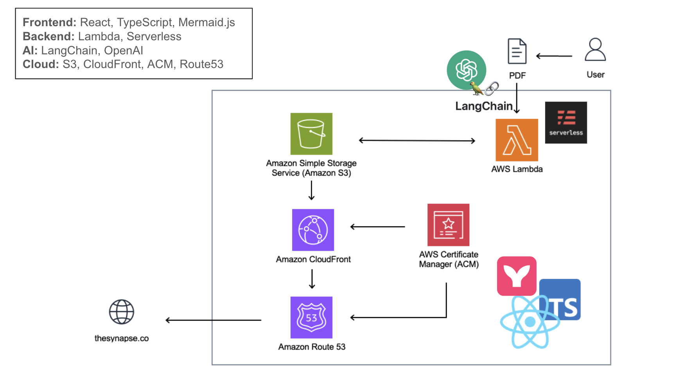
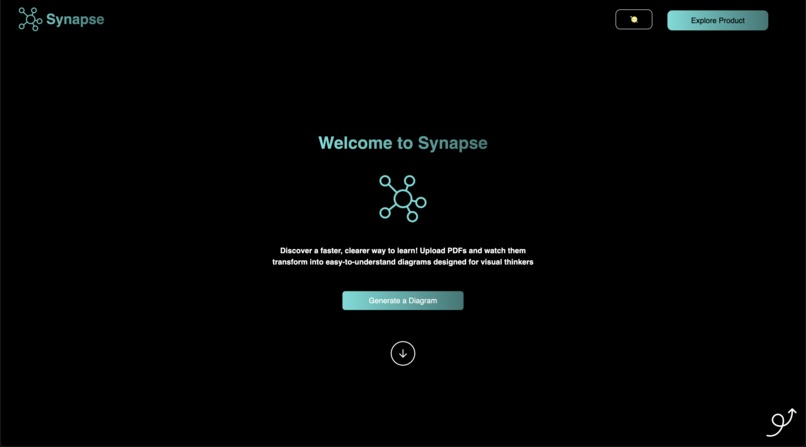

## 🚀 Tech Stack

## ☁️ Inspiration
In the information-driven era, professionals and organizations frequently grapple with vast amounts of data encapsulated within PDF documents. Extracting meaningful insights and visual representations from these documents is often time-consuming and labor-intensive. We envisioned Synapse as a solution to bridge this gap by leveraging artificial intelligence to streamline the extraction and visualization process. Inspired by the need for efficiency and clarity, **Synapse** empowers users to transform dense PDF content into easily digestible summaries and intuitive diagrams, enhancing comprehension and decision-making.

## 📊 What it does
Synapse is an intelligent PDF parsing tool designed to revolutionize how users interact with PDF documents. Upon receiving a PDF as input, Synapse performs the following actions:

**Key Information Extraction**: Utilizes advanced AI algorithms to identify and extract critical information from the PDF, ensuring that the most relevant data is captured.

**Mermaid Code Generation**: Transforms the extracted information into Mermaid code, a text-based diagramming tool that facilitates the creation of clear and structured visual representations.

**Summary Generation**: Produces concise and comprehensive summaries of the PDF content, providing users with quick insights without the need to sift through lengthy documents.

**User Interface Display**: Renders the generated Mermaid diagrams on an intuitive and user-friendly interface, allowing users to visualize the structure and key points of their PDFs effortlessly.

By automating these processes, Synapse significantly reduces the time and effort required to analyze and comprehend PDF documents, making it an invaluable tool for professionals across various industries.

## 💻 How we built it
**1. Frontend Development:**
React.js:
Mermaid.js Integration

**2. Serverless Development:**
TypeScript, AWS Lambda, Serverless

**3. PDF Processing and AI Integration:**
pdf-parse & pdf-lib
OpenAI GPT-4o API
LangChain
